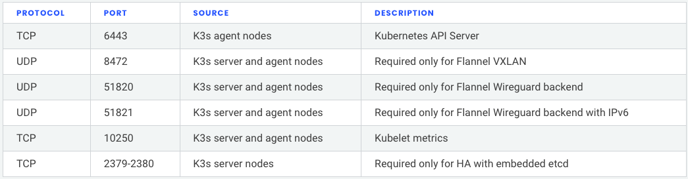
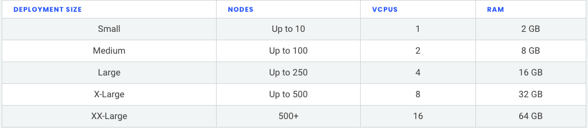

# K3s Installation Requirements 

K3s is very lightweight, but has some minimum requirements as outlined below.

## Prerequisites
Two nodes cannot have the same hostname.

If all your nodes have the same hostname, use the --with-node-id option to append a random suffix for each node, or otherwise devise a unique name to pass with --node-name or $K3S_NODE_NAME for each node you add to the cluster.

## Operating Systems
K3s is expected to work on most modern Linux systems.

## Hardware
Hardware requirements scale based on the size of your deployments. Minimum recommendations are outlined here.

RAM: 512MB Minimum (we recommend at least 1GB), CPU: 2 (1 Minimum)

## Disks
K3s performance depends on the performance of the database. To ensure optimal speed, we recommend using an SSD when possible. Disk performance will vary on ARM devices utilizing an SD card or eMMC.

## Networking
The K3s server needs port 6443 to be accessible by all nodes.

Inbound Rules for K3s Server Nodes

## Large Clusters
Hardware requirements are based on the size of your K3s cluster. For production and large clusters, we recommend using a high-availability setup with an external database. The following options are recommended for the external database in production:

MySQL, PostgreSQL, etcd

## CPU and Memory

The following are the minimum CPU and memory requirements for nodes in a high-availability K3s server:

## Database

K3s supports different databases including MySQL, PostgreSQL, MariaDB, and etcd, the following is a sizing guide for the database resources you need to run large clusters:

For more information [Click here](https://rancher.com/docs/k3s/latest/en/installation/installation-requirements/)